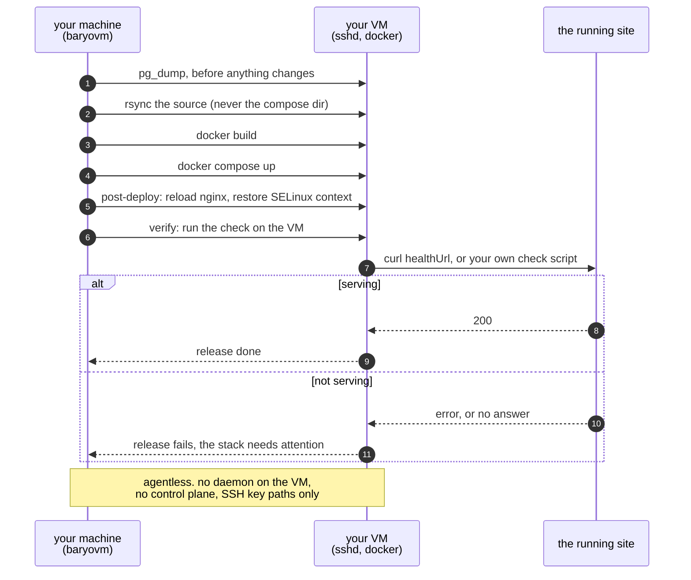

<div align="center">
  
  <h1>BaryoVM</h1>
  <p><em>PaaS-style deploys on your own cheap VMs: agentless, over SSH, from one CLI.</em></p>
  <p>
    
    
    
  </p>
</div>

BaryoVM is a small Go CLI that registers your existing VMs and drives the Docker
Compose stacks on them **over plain SSH**, with no agent or daemon to install. It
gives you the day-to-day parts of a PaaS (deploy, release, backup, restore, logs)
without a control-plane to host, and every command speaks `-o json` so a future
UI, MCP server, or agent can drive the exact same surface.

> **Status: early-stage.** The SSH · compose · **release** · **backup/restore**
> paths are tested and used daily. VM *provisioning* (AWS Lightsail) is billable
> and ships behind `--dry-run`, so treat it as experimental. Not affiliated with any
> cloud provider.

## How it works

Everything runs from your machine over SSH. There is no agent on the VM, no
control plane, and nothing extra listening that you have to secure.



The backup comes first on purpose: one taken afterwards would already contain
whatever a start-time migration did. The verify step is the one that turns
"every command succeeded" into "the site is serving", and those are not the
same thing.

The tool stores SSH key **paths**, never key material, and never reads your
application secrets. A stack's compose directory is never in a release
manifest's sync list, so `--delete` cannot wipe a `.env`.

## Install

```sh
go install github.com/BaryoDev/BaryoVM/cmd/baryovm@latest   # -> $(go env GOPATH)/bin
# or build locally:
go build -o /usr/local/bin/baryovm ./cmd/baryovm
baryovm version
```

State lives in `~/.baryovm/fleet.json` (override with `BARYOVM_HOME`), written
owner-only (`0600`). It stores hostnames, users and **SSH key paths, never key
contents or secrets**. See [SECURITY.md](SECURITY.md).

## Quickstart

```sh
# 1) Register a VM you already have (agentless, uses your SSH key)
baryovm vm add oracle --host <your-vm-ip> --user opc --key ~/.ssh/id_ed25519
baryovm vm ping oracle          # SSH in, report host + Docker version
baryovm vm bootstrap oracle     # install Docker if missing

# 2) Register a compose stack (a project dir on that VM), with backup + release config
baryovm stack add app --vm oracle --path /home/deploy/app/deploy \
  --db-container app-postgres-1 --db-name app --env-file .env \
  --release-file ./baryovm.release.json

# 3) Deploy: sync source -> build images on the VM -> compose up (backs up first)
baryovm stack release app

# 4) Backups, any time
baryovm stack backup app
baryovm stack restore app --yes
```

## Commands

| Area | Commands |
|------|----------|
| **VMs** | `vm add · list · ping · bootstrap · remove` |
| **Stacks** | `stack add · list · remove · ps · logs · pull` |
| **Deploy** | `stack deploy` (compose up) · **`stack release`** (sync → build → deploy) |
| **Backups** | **`stack backup`** · `stack backups` · **`stack restore --yes`** |
| **Single container** | `deploy` |
| **Provision** (experimental, billable) | `vm provision` · `up` (behind `--dry-run`) |
| **Local** | `doctor [--fix]` · `version` |

Full flags and examples: **[USAGE.md](USAGE.md)**.

### `stack release` is config-driven

A JSON manifest in your repo describes what to sync + build + deploy. The CLI has
no app-specific logic. The compose dir (with its `.env`) is deliberately **never**
in the sync list, so `--delete` can't wipe your secrets.

`verify` is what stops a release calling itself done without asking the running
site anything. Point it at a check script the repo already has, or leave it out
and set `healthUrl` on the stack and a `curl --fail` probe is used instead.

```json
{
  "localRoot": "~/repos/app",
  "remoteRoot": "/home/deploy/app",
  "sync": ["api", "web"],
  "exclude": ["bin", "obj", "node_modules", ".next", ".git"],
  "builds": [
    { "image": "app-api:latest", "dockerfile": "deploy/Dockerfile.api", "context": "api" },
    { "image": "app-web:latest", "dockerfile": "deploy/Dockerfile.web", "context": "web",
      "args": { "NEXT_PUBLIC_API_URL": "" } }
  ]
}
```

## Why not just ask a coding agent to deploy it

An agent can absolutely `ssh` in, `rsync` a directory and run `docker compose up`.
It will usually work. The problem is what "usually" costs.

**It reconstructs the deploy every time.** Nothing is written down, so each run
re-derives the host, the paths, the build order and the restart command from
whatever it can infer that day. A deploy is a thing you want to be identical on
the fortieth run and the first. `baryovm stack release app` is one command that
does the same thing every time, and the manifest is in your repository where a
reviewer can see it.

**The dangerous commands are the ones easiest to get subtly wrong.** This tool
carries a comment about rsync's trailing-slash rule because getting it wrong,
combined with `--delete`, empties a webroot and puts the site one directory
down. That is a live outage produced by a single character. An agent writing
rsync from scratch is one plausible-looking flag away from it, and the output
looks like success.

**Safety defaults do not survive improvisation.** A release here backs the
database up before it touches anything, because a backup taken afterwards
already contains whatever a start-time migration did. The compose directory is
never in the sync list, so `--delete` cannot reach a `.env`. An unattended
update refuses to run on a stack with no health check, because an update that
cannot tell a healthy start from a crash loop is worse than no update. Each of
those is a rule someone learned the hard way; none of them are things an agent
reliably reinvents under time pressure.

**Credentials stay out of the conversation.** BaryoVM stores SSH key *paths*,
never key material, and never reads your application secrets. An agent driving
`ssh` directly needs the connection details in its context to work at all.

**And yes, the tokens.** A deploy driven conversationally means reading the
repository, inferring the topology, composing the commands, reading the output
and iterating when something fails. That is a meaningful slice of a context
window every single time, and you pay it again on the next deploy. One command
costs none of it.

The honest version of this argument is not that agents cannot deploy. It is
that a deploy should be a *decision you already made*, encoded once, rather
than a thing re-reasoned from first principles while you watch. Use the agent
to change the code. Let the tool ship it.

## Automation-friendly

Add `-o json` to any command for a stable result envelope:

```json
{ "ok": true, "action": "stack release", "message": "app released" }
```

This is how the planned MAUI desktop/mobile app and **MCP server** will drive
BaryoVM. The CLI is the single source of truth.

## Where it's going

BaryoVM today is the CLI core. The broader plan, a self-hosted control plane
(native app + MCP server) over Docker with provider adapters (SSH / Lightsail /
OCI), reverse-proxy and DNS ("type a domain, click"), GitHub deploys and email,
lives in [docs/VISION.md](docs/VISION.md).

## Development

```sh
go build ./...
go vet ./...
go test -race ./...
gofmt -l .          # should print nothing
```

## License

[MPL-2.0](LICENSE), open source; per-file notices in every source file. Chosen
deliberately: a tool that holds SSH key paths and drives your machines should be
auditable.
